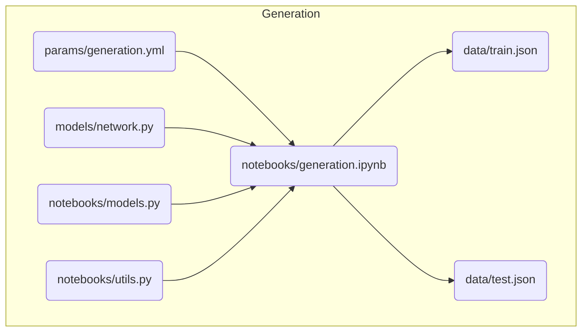
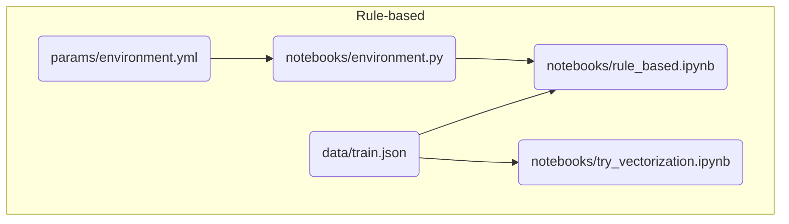
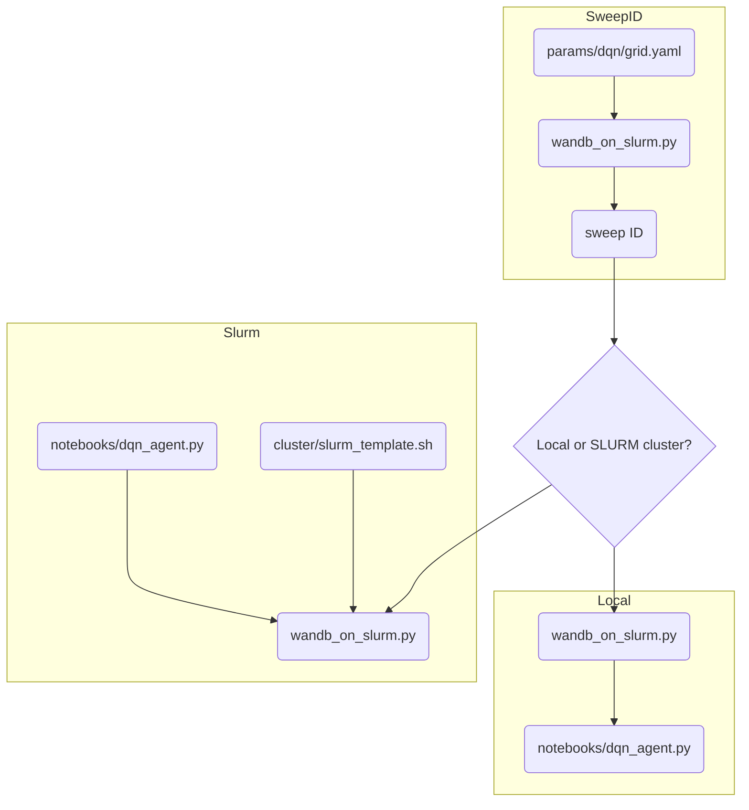

# Reward Network II

## Install required packages

Here Python 3.10.8 was used

```bash
python3 -m venv .venv
# Mac/Linux
. .venv/bin/activate 
# Windows
# source .venv/Scripts/Activate 


pip install --upgrade pip
pip install wheel
pip install -r requirements.txt
```

## Repo organization

* **notebooks**: includes `.ipynb`,`.py` files to generate reward networks and solve them
* **cluster**: includes bash script(s) to submit jobs to the MPI SLURM cluster (Tardis)
* **models**: includes `.py` files used for parsing and validation of JSON data
* **params**: includes `.yml` files for each file in notebooks specifying parameters
* **rn**: includes utilities used in the scripts in `notebooks` folder
* **data**: includes json files where all generated reward networks used in the experiment are stored. The `_viz` suffix in the file names indicate those data files that have additional node location information (for frontend vizualization purposes)

## Workflow

### Network generation



### Rule-based strategy comparisons



### DQN + Wandb

Training the DQN model both locally and on cluster is organized in the `wandb_on_slurm.py` script.

First, we create a sweep ID (command `create`) by specifying a parameter grid file: this file contains the path to the script to run (in our case `notebooks/dqn_agent.py`), parameter names and respective values.

```python
python wandb_on_slurm.py create params/dqn/grid.yaml
```

After we get the sweep ID we can:

* run the sweep locally (command `local` followed by sweep ID)

```python
python wandb_on_slurm.py local <sweep_id>
```

* run the sweep on SLURM cluster (command `slurm` followed by sweep ID and the worker in the cluster)

```python
python wandb_on_slurm.py slurm <sweep_id> <number or worker>
```


