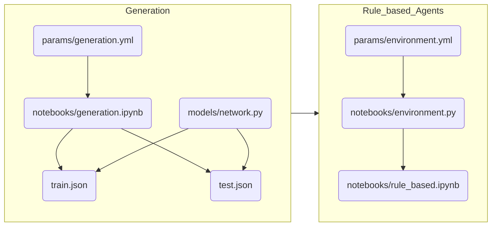

# Reward Network II

## Install required packages

```
python3 -m venv .venv
. .venv/bin/activate
pip install --upgrade pip
pip install wheel
pip install -r requirements.txt
```

## Run

```

```

## Repo organization
* **notebooks**: includes `.ipynb`,`.py`,`.sh` files to generate reward networks and solve them
* **models**: includes `.py` files used for parsing and validation of JSON data
* **params**: includes `.yml` files for each file in notebooks specifying parameters
* **rn**: includes utilities used in the scripts in `notebooks` folder

## Workflow



