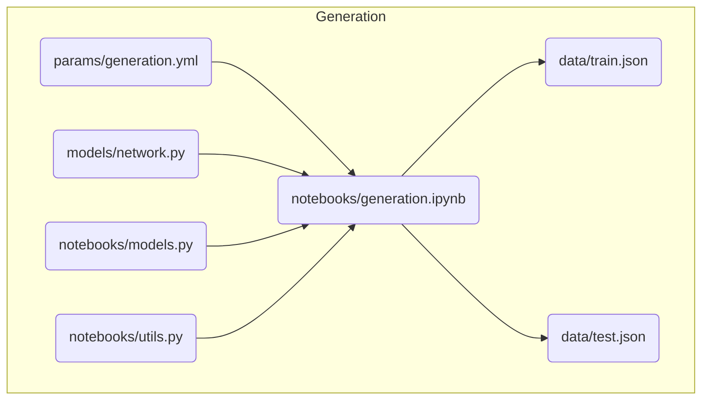
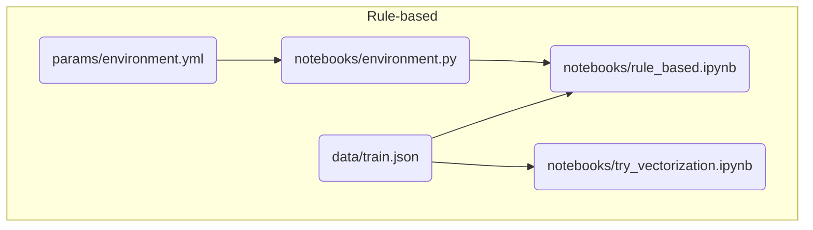
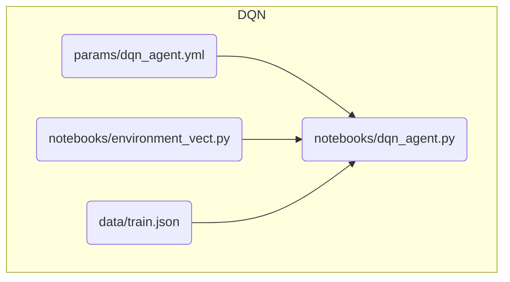

# Reward Network II

## Install required packages

```bash
python3 -m venv .venv
# Mac/Linux
. .venv/bin/activate 
# Windows
# source .venv/Scripts/Activate 
pip install --upgrade pip
pip install wheel
pip install -r requirements.txt
```

## Run

```
TODO
```

## Repo organization
* **notebooks**: includes `.ipynb`,`.py`,`.sh` files to generate reward networks and solve them
* **models**: includes `.py` files used for parsing and validation of JSON data
* **params**: includes `.yml` files for each file in notebooks specifying parameters
* **rn**: includes utilities used in the scripts in `notebooks` folder
* **data**: includes json files where all generated reward networks used in the experiment are stored. The `_viz` suffix in the file names indicate those data files that have additional node location information (for frontend vizualization purposes)


## Workflow
### Network generation


### Rule-based strategy comparisons


### DQN 



